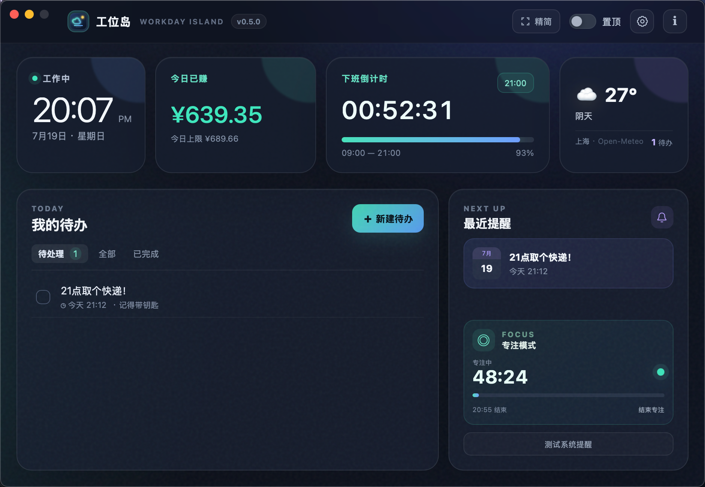
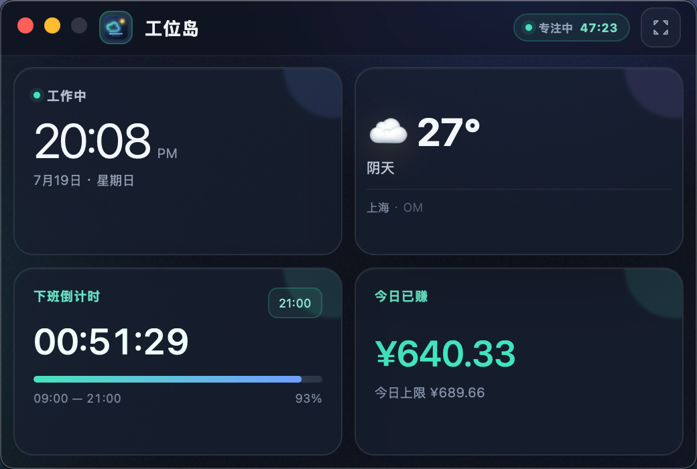

# 工位岛 · Workday Island

[中文](README.md) · [English](README_EN.md)

一款常驻桌面的轻量工作助手：把时间、下班倒计时、天气、待办、持续提醒、专注计时和今日已赚集中到一座安静的“工位岛”上。



## 下载与安装

前往 [GitHub Releases](https://github.com/asbacklight-justin/workday-island/releases/latest) 下载最新版。

| 平台 | 安装包 | 支持范围 |
| --- | --- | --- |
| macOS | `Workday-Island-v0.6.0-macOS-universal.dmg` | macOS 12+，Apple Silicon（M 系列）与 Intel |
| Windows | `Workday-Island-v0.6.0-windows-x64-Setup.exe` | Windows 10/11 x64，依赖 Microsoft Edge WebView2 |

当前公开安装包未使用商业代码签名证书：macOS 首次运行时可在 Finder 中右键应用并选择“打开”；Windows 可能显示 SmartScreen 提示，请确认文件来自本项目的 GitHub Release。请不要从未知转载站点下载安装。

## 核心功能

- **桌面置顶**：主窗口可随时置顶，让倒计时与待办始终触手可及。
- **精简模式**：隐藏标题头，采用 2×2 核心卡片布局；窗口可在 400×270 至 900×600 之间调整并记住尺寸，内部字号、间距与组件同比缩放；可选展示未完成待办。
- **下班倒计时**：自定义上下班时间与每周工作日，实时展示剩余时间和当日进度。
- **今日已赚**：根据月薪、月计薪天数与当天工作进度估算；支持自定义货币符号；不填写月薪时自动隐藏，不收集薪资数据。
- **待办与提醒**：创建、编辑、完成、筛选和删除待办，可分别选择提醒日期与时间。
- **不会错过的提醒**：到点后窗口自动恢复并置前，多颜色闪烁并周期播放简短提示音，直到用户点击确认。
- **专注模式**：提供 25、50、90 分钟快捷计时；会话本地持久化，结束后置前提醒休息，直到确认。
- **天气**：通过 Open-Meteo 查询指定城市的当前天气，无需 API Key；网络波动时自动重试并回退到最近一次本地缓存。
- **深浅主题**：支持跟随系统、深色与浅色主题。
- **中英双语**：支持跟随系统、简体中文与 English，可在设置中随时切换。
- **在线检查更新**：每天最多查询一次 GitHub Releases，也可在“关于”页手动检查并一键打开对应平台安装包。
- **本地优先**：设置、待办和专注状态只保存在本机，不需要账号和自建服务端。

## 界面预览

### 完整模式

集中查看时间、收入、倒计时、天气、待办、下一条提醒与专注状态。


### 精简模式

2×2 布局适合长期放在桌面一角，并支持自由调整窗口大小。



### 设置

配置上下班时间、月薪、计薪天数、天气城市、工作日、语言和窗口置顶。


英文界面截图请查看 [English README](README_EN.md#screenshots)。

## 使用说明

1. 打开设置，填写上下班时间并选择工作日。
2. 如需“今日已赚”，再填写月薪与月计薪天数；留空或设为 `0` 即隐藏该卡片。
3. 填写天气城市。应用仅在刷新天气时向 Open-Meteo 发送城市查询。
4. 新建待办并按需添加提醒日期和时间。提醒触发后，点击提醒画面即可停止闪烁和声音。
5. 在专注卡片选择 25、50 或 90 分钟。计时结束后应用会持续提醒休息，直到确认。
6. 点击顶部“精简”切换 2×2 小窗；拖动窗口任意空白区域移动，拖动窗口边缘缩放，应用会记住精简尺寸。
7. 在“关于”页点击“检查更新”；发现新版后可打开 GitHub 下载对应平台安装包。更新仍由用户确认安装，不会静默替换应用。

## 技术栈与架构

- Go 1.23+
- [Wails v2](https://wails.io/) 桌面窗口与 Go/JavaScript 桥接
- 原生 HTML、CSS、JavaScript 前端，静态资源通过 `embed.FS` 打包进可执行文件
- JSON 本地持久化
- macOS AppKit 窗口激活与系统通知；Windows 原生通知/声音适配
- Open-Meteo 地理编码与天气接口

项目不依赖 Backlight 主仓库的 Go 后端或 Vue 管理端，`workday-island` 目录可独立构建与发布。

## 本地开发

```bash
git clone https://github.com/asbacklight-justin/workday-island.git
cd workday-island
go mod download
go test ./...
go run .
```

`go run .` 适合快速调试 Go 端。若需要 Wails 开发热重载，可安装 Wails CLI 后执行 `wails dev`。

数据默认位置：

- macOS：`~/Library/Application Support/WorkdayIsland/data.json`
- Windows：`%AppData%\WorkdayIsland\data.json`

完整构建、打包和发布说明见 [构建指南](docs/BUILD.zh-CN.md)。

## 隐私与联网

待办、提醒、薪资、工作时间和专注记录只写入本机 JSON 文件。天气功能会访问 Open-Meteo；版本检查会访问本项目的 GitHub Releases API。应用没有账号系统、遥测、广告 SDK 或自有服务端。详情见 [隐私说明](docs/PRIVACY.zh-CN.md)。

## 参与贡献

欢迎提交 Issue 和 Pull Request。开始前请阅读：

- [中文贡献指南](CONTRIBUTING.zh-CN.md)
- [安全政策](SECURITY.md)
- [更新日志](CHANGELOG.md)
- [第三方声明](THIRD_PARTY_NOTICES.md)

## 路线图

- 正式的 Apple Developer ID 签名与公证
- Windows Authenticode 签名
- 自定义专注时长、长休息和番茄循环
- 提醒稍后再提醒与重复规则
- 可选的系统启动时运行

路线图代表计划方向，不构成版本承诺。

## 版本、作者与许可

- 当前版本：`v0.6.0`
- 作者：Backlight Studio
- 联系邮箱：[asbacklight@gmail.com](mailto:asbacklight@gmail.com)
- 开源许可：[MIT License](LICENSE)
