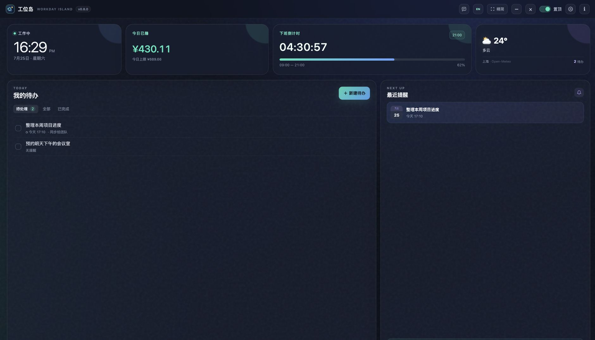
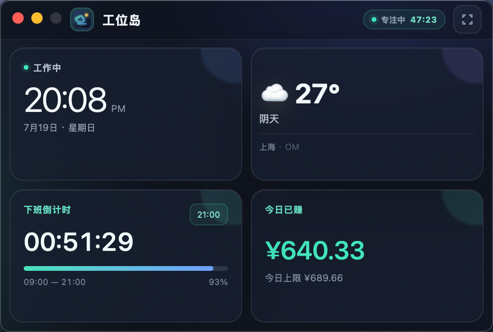
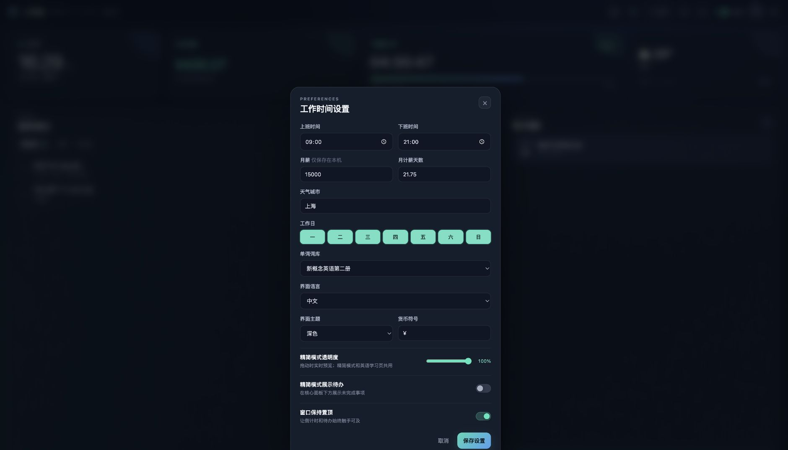
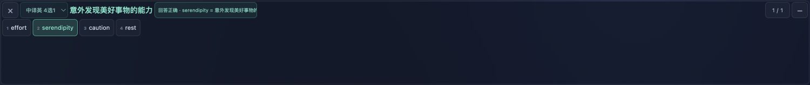
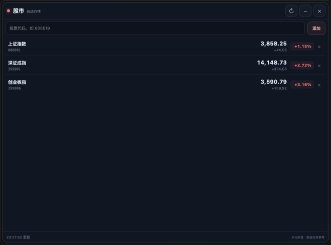

# 工位岛 · Workday Island

[中文](README.md) · [English](README_EN.md)

一款常驻桌面的轻量工作助手：把时间、下班倒计时、天气、待办、持续提醒、专注计时、AI 对话、云笔记、链接分享、英语学习、全能翻译、好友聊天和工作云盘集中到一座安静的“工位岛”上。



## 下载与安装

前往 [GitHub Releases](https://github.com/asbacklight-justin/workday-island/releases/latest) 下载最新版。

| 平台 | 安装包 | 支持范围 |
| --- | --- | --- |
| macOS | `Workday-Island-v0.16.0-macOS-universal.dmg` | macOS 12+，Apple Silicon（M 系列）与 Intel |
| Windows | `Workday-Island-v0.16.0-windows-x64-Setup.exe` | Windows 10/11 x64，依赖 Microsoft Edge WebView2 |

当前公开安装包未使用商业代码签名证书：macOS 首次运行时可在 Finder 中右键应用并选择“打开”；Windows 可能显示 SmartScreen 提示，请确认文件来自本项目的 GitHub Release。请不要从未知转载站点下载安装。

## 核心功能

- **桌面置顶**：主窗口可随时置顶，让倒计时与待办始终触手可及。
- **系统托盘常驻**：点击叉号后，Windows 从任务栏隐藏、macOS 从 Dock 隐藏，但待办与专注提醒仍在后台运行；左键托盘/菜单栏图标恢复窗口，右键菜单可直接进入聊天、英语、AI、云盘、翻译或股市，也可彻底退出。菜单语言会跟随应用界面。
- **精简模式**：隐藏标题头，采用 2×2 核心卡片布局；窗口可在 400×270 至 900×600 之间调整并记住尺寸，内部字号、间距与组件同比缩放；支持 30%–100% 透明度并可选展示未完成待办。
- **下班倒计时**：自定义上下班时间与每周工作日，实时展示剩余时间和当日进度。
- **今日已赚**：根据月薪、月计薪天数与当天工作进度估算；支持自定义货币符号；不填写月薪时自动隐藏，不收集薪资数据。
- **待办与提醒**：创建、编辑、完成、筛选和删除待办，可分别选择提醒日期与时间。
- **不会错过的提醒**：到点后窗口自动恢复并置前，多颜色闪烁并周期播放简短提示音，直到用户点击确认。
- **专注模式**：提供 25、50、90 分钟快捷计时；会话本地持久化，结束后置前提醒休息，直到确认。
- **天气**：通过 Open-Meteo 查询指定城市的当前天气，无需 API Key；网络波动时自动重试并回退到三小时内的本地缓存，避免长期展示过期天气。
- **会员身份与专属主题**：通过 `/user/info` 实时识别普通、Plus、Pro 与 Ultra 身份，展示真实头像和逐级增强的会员徽章；Plus、Pro、Ultra 除各自的“曜金紫晶”“全息极光”“黑曜星钻”深色主题外，还分别拥有“樱金晨曦”“冰川晴空”“星钻白曜”亮色主题。高级会员可使用本级及以下主题，权限由界面与 Go 后端双重校验。
- **中英双语**：支持跟随系统、简体中文与 English，可在设置中随时切换。
- **可配置顶部入口**：设置页最上方可分别控制 AI、聊天、股市、云盘、云笔记、分享、翻译、英语学习和通知中心入口是否显示；默认全部开启，升级旧版本后也不会丢失入口。
- **站内信 / 通知中心**：登录后在顶部显示未读角标，集中查看系统、业务、安全和公告通知；支持筛选、分页、已读、全部已读、删除和详情跳转。
- **英语学习中心**：点击顶部 `EN` 按钮先进入学习中心；“单词本”在本机跨天汇总五种模式实际刷过的单词、音标、释义、例句、词库、模式和学习次数，“错题本”记录英译中、中译英与拼写模式的错词、最近答案和累计错误次数。点击“精简学习”才会打开紧凑学习窗；macOS 与 Windows 均只让背景跟随悬浮窗透明度，核心内容始终清晰。
- **可选单词词库**：英语学习默认使用《新概念英语》第二册，也可在设置中切换到新概念三、四级、六级、雅思或全部公共词库。
- **股市悬浮窗**：默认展示上证指数、深证成指和创业板指，可添加最多 12 个 A 股自选代码；小窗每 5 秒刷新并复用悬浮窗透明度，断网时保留最近行情。
- **更新、Web 端与意见反馈**：每天最多查询一次 GitHub Releases，也可在“关于”页手动检查、一键打开对应平台安装包、访问 [Backlight Web 端](https://admin.asbacklight.cn/) 或无需登录直接提交问题和建议。
- **统一账号入口**：登录和注册集中在独立账号中心；登录一次即可共享 AI 对话、聊天、好友、工作云盘、云笔记、链接分享和全能翻译，退出账号时相关在线服务同步退出，工作台会展示当前昵称。
- **桌面 AI 对话**：登录后可直接在应用中创建、搜索、置顶、归档、重命名和删除会话，选择可用模型与思考模式，支持流式回答、停止生成、代码块复制、Markdown 展示、使用额度和个性化系统提示。
- **云笔记**：使用统一账号跨端访问笔记与文件夹，可创建普通富文本、Markdown 和兼容 Web 后台的表格文档，支持自动保存、搜索、收藏、置顶、移动、回收站、历史版本、阅读密码、AI 整理、翻译以及导出；文件夹内始终优先展示置顶内容。
- **链接分享**：为云笔记创建快照或实时分享，可配置访问密码、有效期、复制和评论权限；独立分享管理页支持搜索、修改、撤销、重新生成、打开和删除链接，并展示分享额度与访问次数。
- **实时聊天、好友与窗口互动**：按精确用户名/用户 ID 添加好友、处理好友申请和查看在线状态；文字消息、抖一抖和闪一闪均写入会话记录，互动优先展示昵称。
- **工作云盘**：复用同一账号浏览目录、搜索、新建文件夹、重命名、移动、删除、上传和下载文件，并展示账号的实时存储配额。
- **全能翻译**：登录后支持自动检测源语言及中、英、日、韩、法、德、西、俄、葡、阿多语言互译；展示账号每日额度，支持历史搜索、单条/批量删除和 Excel 导出。
- **本地优先**：设置、待办、薪资和专注状态只保存在本机；账号密码与访问令牌仅保留在当前运行会话内，不写入本地数据文件。

## 界面预览

### 完整模式

集中查看时间、收入、倒计时、天气、待办、下一条提醒与专注状态。


### 精简模式

2×2 布局适合长期放在桌面一角，并支持自由调整窗口大小。



### 设置

配置顶部功能入口、上下班时间、月薪、计薪天数、天气城市、工作日、英语词库、语言和窗口置顶。



### AI 对话

在桌面端直接使用 DeepSeek 模型，管理会话、思考模式、使用额度与个性化设置。


### 英语学习中心

在自动贴合内容的小窗口中完成单词、双语例句、四选一和拼写练习，答案结果与上一词会立即显示。



### 实时聊天

登录统一账号后通过好友列表快速聊天，并支持申请处理、在线状态、抖动、闪烁与提示语等窗口互动；互动事件也会保留在聊天记录中。


### 股市悬浮窗

默认展示三大指数，并可添加 A 股自选代码；紧凑小窗每 5 秒刷新行情、继承透明度设置，关闭后工作台自动回到屏幕中央。



英文界面截图请查看 [English README](README_EN.md#screenshots)。

## 使用说明

1. 打开设置，填写上下班时间并选择工作日。
2. 如需“今日已赚”，再填写月薪与月计薪天数；留空或设为 `0` 即隐藏该卡片。
3. 填写天气城市。应用仅在刷新天气时向 Open-Meteo 发送城市查询。
4. 新建待办并按需添加提醒日期和时间。提醒触发后，点击提醒画面即可停止闪烁和声音。
5. 在专注卡片选择 25、50 或 90 分钟。计时结束后应用会持续提醒休息，直到确认。
6. 点击顶部“精简”切换 2×2 小窗；拖动窗口任意空白区域移动，拖动窗口边缘缩放，应用会记住精简尺寸。
7. 在“关于”页点击“检查更新”；发现新版后可打开 GitHub 下载对应平台安装包，也可从这里进入 [Backlight Web 端](https://admin.asbacklight.cn/)。更新仍由用户确认安装，不会静默替换应用。
8. 点击叉号会隐藏到系统托盘而不会结束提醒；Windows 会移除任务栏窗口，macOS 会移除 Dock 图标。左键托盘/菜单栏图标恢复窗口，右键可打开各在线模块或选择“退出”彻底结束应用。
9. 点击顶部账号按钮登录或注册。邀请码为选填；登录后聊天、工作云盘和全能翻译共享会话，退出账号时三者同时退出。
10. 点击顶部 AI 按钮使用桌面 AI 对话；会话、消息、模型权限和使用额度与当前账号绑定。
11. 点击顶部聊天按钮，从好友列表直接进入会话；仍可手动输入用户 ID 聊天、抖动或闪烁对方窗口。详情见[实时聊天说明](docs/REALTIME_CHAT.zh-CN.md)。
12. 点击顶部云盘按钮浏览工作云盘，可新建目录并上传、下载、重命名、移动或删除文件。
13. 点击顶部笔记按钮进入云笔记；编辑内容会自动保存，可在更多菜单中管理历史版本、阅读密码、导出和删除，并通过分享按钮创建链接。
14. 点击顶部分享按钮进入分享管理，查看、修改、撤销、重新生成或删除当前账号创建的笔记分享。
15. 点击顶部 `EN` 按钮进入英语学习中心查看本机单词本与错题本；点击“精简学习”打开五种学习模式，并可在设置中选择所用词库。学习记录从安装此功能的版本开始生成。
16. 点击顶部 `译` 按钮进入全能翻译；可查看每日额度、自动识别源语言、复制译文，并管理或导出当前账号的翻译历史。

## 技术栈与架构

- Go 1.23+
- [Wails v2](https://wails.io/) 桌面窗口与 Go/JavaScript 桥接
- 原生 HTML、CSS、JavaScript 前端，静态资源通过 `embed.FS` 打包进可执行文件
- JSON 本地持久化
- macOS AppKit 与 Windows Shell 原生系统托盘；平台原生窗口激活、通知与声音适配
- Open-Meteo 地理编码与天气接口
- Backlight 账号认证、AI 对话、云笔记、链接分享、翻译服务、好友协议、WebSocket 实时通信与对象存储直传

桌面客户端可在 `workday-island` 目录独立构建与发布；待办、倒计时等本地功能不依赖服务器，账号、AI 对话、聊天、云笔记、链接分享、翻译、英语在线词库与工作云盘功能使用 Backlight 服务。

## 本地开发

```bash
git clone https://github.com/asbacklight-justin/workday-island.git
cd workday-island
go mod download
go test ./...
go run .
```

`go run .` 适合快速调试 Go 端。若需要 Wails 开发热重载，可安装 Wails CLI 后执行 `wails dev`。

数据默认位置：

- macOS：`~/Library/Application Support/WorkdayIsland/data.json`
- Windows：`%AppData%\WorkdayIsland\data.json`

完整构建、打包和发布说明见 [构建指南](docs/BUILD.zh-CN.md)。

## 隐私与联网

待办、提醒、薪资、工作时间、专注记录、英语单词本和错题本只写入本机 JSON 文件。天气访问 Open-Meteo，行情访问东方财富公开接口，版本检查访问 GitHub；用户主动使用账号、AI 对话、聊天、云笔记、链接分享、翻译、英语学习或工作云盘时，相应数据会发送到 Backlight 服务。应用没有遥测或广告 SDK。详情见 [隐私说明](docs/PRIVACY.zh-CN.md)。

## 参与贡献

欢迎提交 Issue 和 Pull Request。开始前请阅读：

- [中文贡献指南](CONTRIBUTING.zh-CN.md)
- [安全政策](SECURITY.md)
- [更新日志](CHANGELOG.md)
- [第三方声明](THIRD_PARTY_NOTICES.md)

## 路线图

- 正式的 Apple Developer ID 签名与公证
- Windows Authenticode 签名
- 自定义专注时长、长休息和番茄循环
- 提醒稍后再提醒与重复规则
- 可选的系统启动时运行

路线图代表计划方向，不构成版本承诺。

## 版本、作者与许可

- 当前版本：`v0.16.0`
- 作者：Backlight Studio
- 联系邮箱：[asbacklight@gmail.com](mailto:asbacklight@gmail.com)
- 开源许可：[MIT License](LICENSE)
