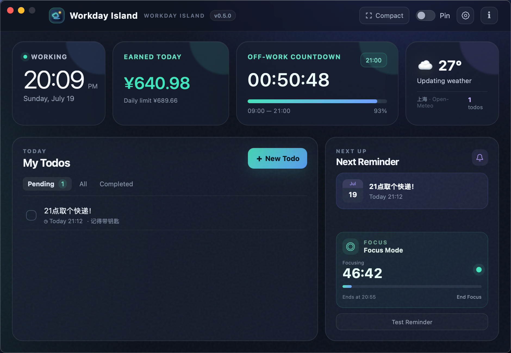
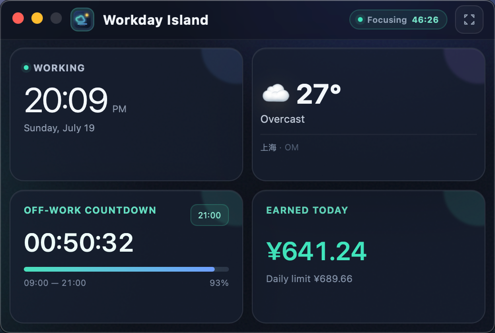
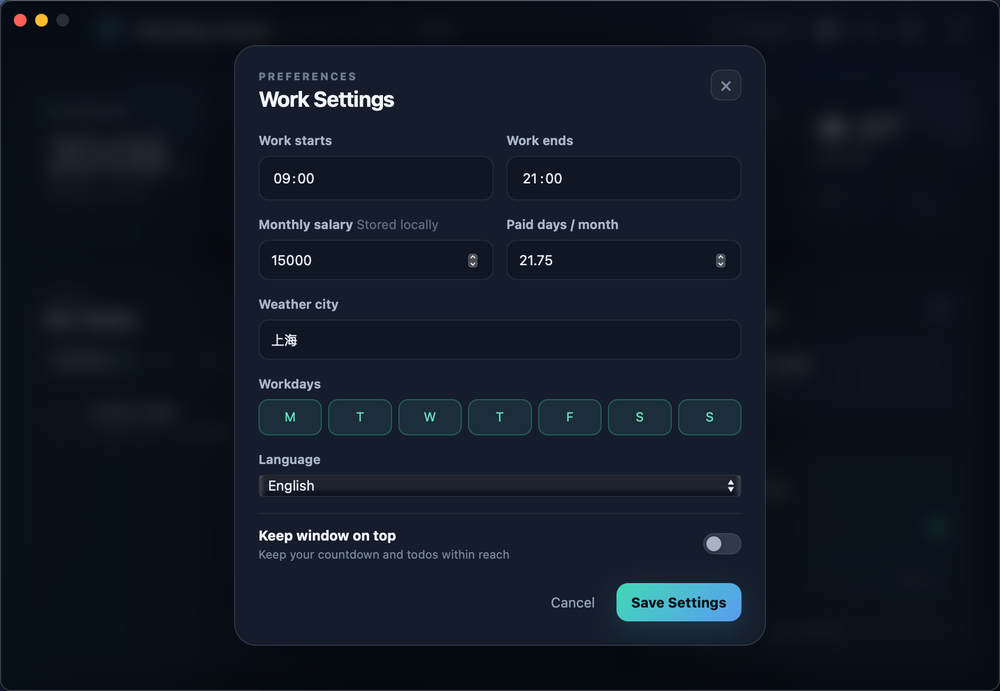

# Workday Island · 工位岛

[中文](README.md) · [English](README_EN.md)

A lightweight desktop companion that keeps time, the off-work countdown, weather, todos, persistent reminders, focus sessions, and today's estimated earnings on one quiet “island.”



## Download and install

Download the latest build from [GitHub Releases](https://github.com/asbacklight-justin/workday-island/releases/latest).

| Platform | Package | Supported systems |
| --- | --- | --- |
| macOS | `Workday-Island-v0.6.2-macOS-universal.dmg` | macOS 12+, Apple Silicon (M-series) and Intel |
| Windows | `Workday-Island-v0.6.2-windows-x64-Setup.exe` | Windows 10/11 x64; Microsoft Edge WebView2 is required |

The public packages are not currently signed with commercial distribution certificates. On macOS, right-click the app in Finder and choose **Open** on first launch. Windows may display a SmartScreen prompt; verify that the file came from this project's GitHub Release. Do not install copies from unofficial download sites.

## Highlights

- **Always on top:** Keep the dashboard, countdown, and todos within reach.
- **System tray:** Closing the window hides it while todo and focus reminders keep running. Left-click restores it; the right-click menu provides the explicit Quit action. macOS also keeps a Dock recovery path when a crowded menu bar obscures the tray item.
- **Resizable compact mode:** A header-free 2×2 card layout that scales proportionally from 400×270 to 900×600, remembers its size, supports 30%–100% opacity, and can optionally show pending todos.
- **Off-work countdown:** Configure work hours and workdays, then see remaining time and daily progress live.
- **Earned today:** Estimate earnings from monthly salary, paid days, and today's progress with a configurable currency symbol. The card disappears when salary is empty or zero.
- **Todos and reminders:** Create, edit, complete, filter, and delete todos with separate reminder date and time controls.
- **Persistent alerts:** A due reminder restores and raises the window, flashes multiple colours, and repeats a short sound until acknowledged.
- **Focus mode:** Start 25, 50, or 90-minute sessions. Sessions persist locally and end with a foreground break reminder that continues until acknowledged.
- **Weather:** Current conditions through Open-Meteo, with automatic retries and a local fallback capped at three hours so outdated conditions are not shown indefinitely.
- **Light and dark themes:** Follow the system appearance or choose light/dark explicitly.
- **Bilingual interface:** Follow the operating system language or explicitly select Simplified Chinese or English.
- **Online update checks:** Query GitHub Releases at most once per day, or check manually from About and open the matching platform package in one click.
- **Local-first storage:** Settings, todos, and focus state stay on the device. No account or custom backend is required.

## Screenshots

### Full dashboard

See the clock, earnings, countdown, weather, todos, next reminder, and focus state together.


### Compact mode

The 2×2 layout fits in a corner of the desktop and remains freely resizable.



### Preferences

Configure work hours, salary, paid days, weather city, workdays, language, and always-on-top behaviour.



See the [Chinese README](README.md#界面预览) for the Chinese screenshots.

## Getting started

1. Open Preferences, set your start/end times, and select the days you work.
2. To enable **Earned today**, enter a monthly salary and paid days per month. Leave salary empty or set it to `0` to hide the card.
3. Enter a weather city. The city query is sent to Open-Meteo only when weather data is refreshed.
4. Create a todo and optionally add a reminder date and time. Click the alert when it fires to stop the flashing and sound.
5. Choose a 25, 50, or 90-minute focus session. When it ends, Workday Island keeps reminding you to take a break until you acknowledge it.
6. Use **Compact** to switch to the 2×2 window. Drag anywhere on its non-control surface to move it and drag an edge to resize it; the size is remembered.
7. Choose **Check for Updates** in About. When a release is available, open the matching GitHub package; installation still requires user confirmation and never silently replaces the app.
8. The close button hides Workday Island to the system tray without stopping reminders. Left-click the tray icon to restore it, or right-click and choose **Quit** to end the app. If macOS hides the tray item because the menu bar is full, click Workday Island in the Dock to restore it.

## Stack and architecture

- Go 1.23+
- [Wails v2](https://wails.io/) for the native window and Go/JavaScript bridge
- Plain HTML, CSS, and JavaScript embedded in the executable through `embed.FS`
- Local JSON persistence
- Native AppKit and Windows Shell system trays, plus platform foreground activation, notification, and sound adapters
- Open-Meteo geocoding and weather APIs

This project is independent of the Backlight monorepo's Go API and Vue admin application. The `workday-island` directory can be built and released on its own.

## Local development

```bash
git clone https://github.com/asbacklight-justin/workday-island.git
cd workday-island
go mod download
go test ./...
go run .
```

`go run .` is convenient for Go-side testing. Install the Wails CLI and run `wails dev` when you need Wails development hot reload.

Default data locations:

- macOS: `~/Library/Application Support/WorkdayIsland/data.json`
- Windows: `%AppData%\WorkdayIsland\data.json`

See the [build and release guide](docs/BUILD.md) for complete packaging instructions.

## Privacy and network access

Todos, reminders, salary, work schedules, and focus sessions are written only to a local JSON file. Weather uses Open-Meteo, and update checks use this project's GitHub Releases API. The app has no account system, telemetry, advertising SDK, or first-party server. Read the full [privacy note](docs/PRIVACY.md).

## Contributing

Issues and pull requests are welcome. Please read:

- [Contributing guide](CONTRIBUTING.md)
- [Security policy](SECURITY.md)
- [Changelog](CHANGELOG.md)
- [Third-party notices](THIRD_PARTY_NOTICES.md)

## Roadmap

- Apple Developer ID signing and notarisation
- Windows Authenticode signing
- Custom focus durations, long breaks, and Pomodoro cycles
- Snooze and recurring reminder rules
- Optional launch at login

The roadmap describes direction, not a release commitment.

## Version, author, and licence

- Current version: `v0.6.2`
- Author: Backlight Studio
- Contact: [asbacklight@gmail.com](mailto:asbacklight@gmail.com)
- Licence: [MIT License](LICENSE)
