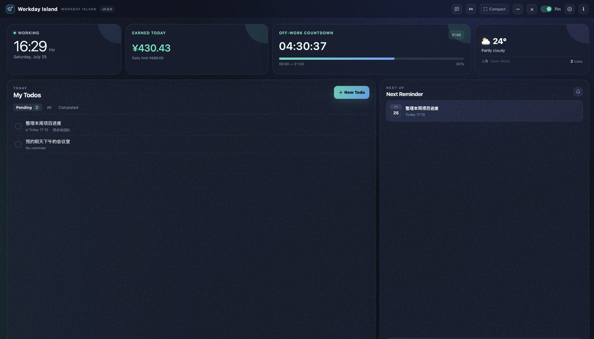
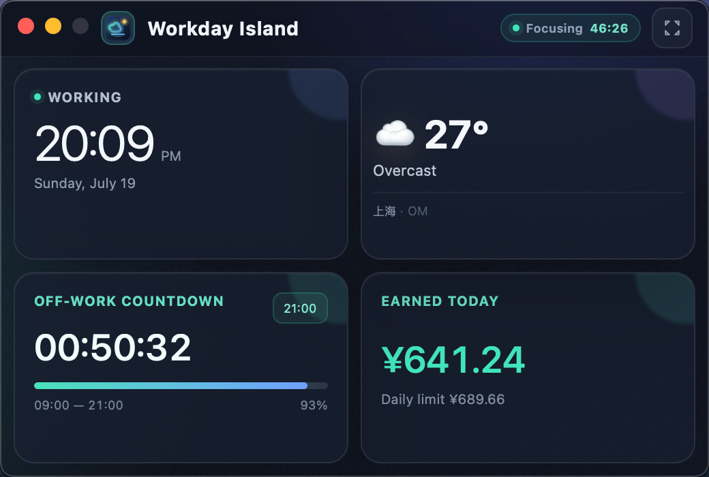
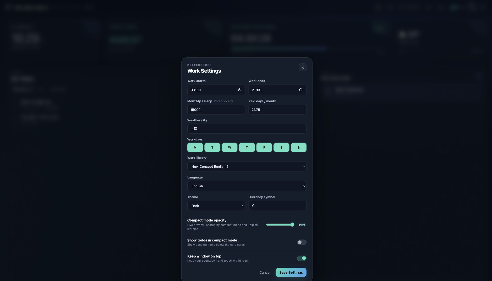
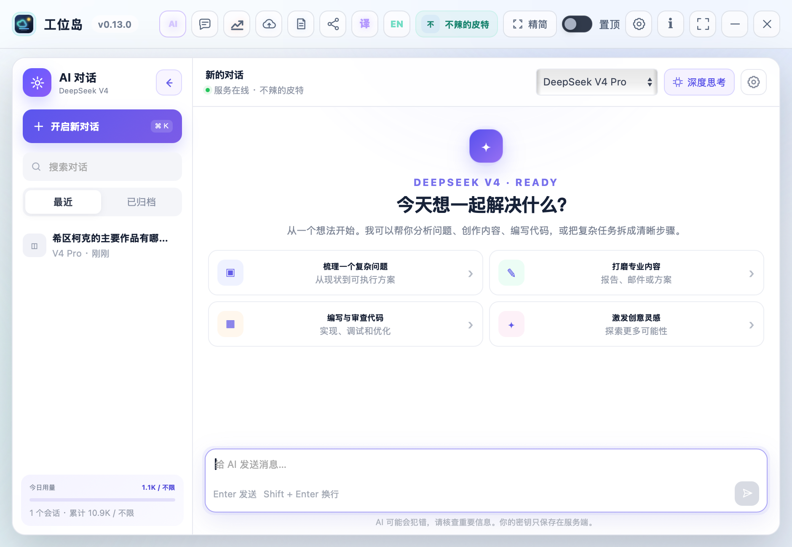
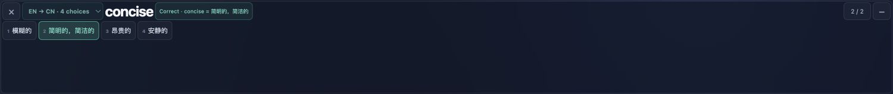
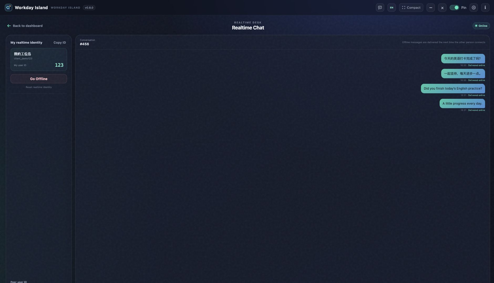
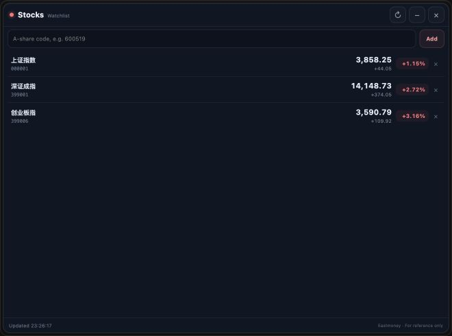

# Workday Island · 工位岛

[中文](README.md) · [English](README_EN.md)

A lightweight desktop companion that keeps time, the off-work countdown, weather, todos, persistent reminders, focus sessions, AI chat, cloud notes, link sharing, English practice, universal translation, friend chat, and Work Cloud on one quiet “island.”



## Download and install

Download the latest build from [GitHub Releases](https://github.com/asbacklight-justin/workday-island/releases/latest).

| Platform | Package | Supported systems |
| --- | --- | --- |
| macOS | `Workday-Island-v0.16.6-macOS-universal.dmg` | macOS 12+, Apple Silicon (M-series) and Intel |
| Windows | `Workday-Island-v0.16.6-windows-x64-Setup.exe` | Windows 10/11 x64; Microsoft Edge WebView2 is required |

The public packages are not currently signed with commercial distribution certificates. On macOS, right-click the app in Finder and choose **Open** on first launch. Windows may display a SmartScreen prompt; verify that the file came from this project's GitHub Release. Do not install copies from unofficial download sites.

## Highlights

- **Always on top:** Keep the dashboard, countdown, and todos within reach.
- **System tray:** Closing hides the Windows taskbar entry or macOS Dock icon while todo and focus reminders keep running. Left-click restores the window; the right-click menu opens Chat, English Learning, AI Chat, Work Cloud, Translator, or Stocks and provides the explicit Quit action. Menu labels follow the app language.
- **Resizable compact mode:** A header-free 2×2 card layout that scales proportionally from 400×270 to 900×600, remembers its size, supports 30%–100% opacity, and can optionally show pending todos.
- **Off-work countdown:** Configure work hours and workdays, then see remaining time and daily progress live.
- **Earned today:** Estimate earnings from monthly salary, paid days, and today's progress with a configurable currency symbol. The card disappears when salary is empty or zero.
- **Todos and reminders:** Create, edit, complete, filter, and delete todos with separate reminder date and time controls.
- **Persistent alerts:** A due reminder restores and raises the window, flashes multiple colours, and repeats a short sound until acknowledged.
- **Focus mode:** Start 25, 50, or 90-minute sessions. Sessions persist locally and end with a foreground break reminder that continues until acknowledged.
- **Weather:** Current conditions through Open-Meteo, with automatic retries and a local fallback capped at three hours so outdated conditions are not shown indefinitely.
- **Membership identity and exclusive themes:** `/user/info` keeps regular, Plus, Pro, and Ultra status current while showing the real avatar and progressively richer membership treatments. Each tier now has both a dark and bright exclusive theme: Plus gets **Violet Gilt** and **Sakura Dawn**, Pro gets **Holographic Aurora** and **Glacier Sky**, and Ultra gets **Obsidian Diamond** and **Stellar White Diamond**. Higher tiers can use their own and lower-tier themes, enforced by both the UI and Go backend.
- **Bilingual interface:** Follow the operating system language or explicitly select Simplified Chinese or English.
- **Configurable header shortcuts:** The first section in Settings independently controls visibility for AI, Chat, Stocks, Fishing Break, Work Cloud, Cloud Notes, Sharing, Translator, English Learning, and Notification Center. All remain visible by default, including after upgrading an older installation.
- **In-app notifications:** Once signed in, the header shows an unread badge for system, business, security, and announcement messages. Notification Center supports filtering, pagination, marking one or all as read, deletion, and detail links.
- **English Learning centre:** The `EN` button opens a full learning centre. Word Book keeps a cross-day history from all five modes and Wrong Book records EN → CN, CN → EN, and spelling mistakes. Plus members and above can read bilingual lesson text and vocabulary in **Textbooks**, or search original works, filter languages, browse chapters, and synchronise page progress in **English Books**. Both readers use spacious immersive layouts, return cleanly to the Learning centre, and preserve content and catalogue position. The compact trainer still opens only from **Compact Study**.
- **Selectable word libraries:** English learning defaults to New Concept English 2 and can switch to NCE 3, CET-4, CET-6, IELTS, or all public words in Settings.
- **Member Fishing Break beta:** The fish-shaped header shortcut opens Fishing Island. Its first mini-game asks you to wait for a bite, reel inside a moving glowing zone, chain accurate hits to fill catch progress, and manage line tension and an escape timer. Fish and rarity are random; the catch journal and best streak stay local. Bruce, Tangerine, Luna, and Cape are now independently tracked switchable pets, each with its own growth, energy, affinity, play charges, and nap cooldown. Feeding consumes catches; play restores one charge per minute (up to three), and naps have a ten-minute cooldown. During beta, entry is limited to Plus, Pro, and Ultra members.
- **Floating stock ticker:** Starts with the SSE Composite, Shenzhen Component, and ChiNext indices, supports up to 12 watched A-share codes, refreshes every five seconds, inherits floating-window opacity, and keeps the latest quotes when offline.
- **Updates, Web App, and feedback:** Query GitHub Releases at most once per day, or use About to check manually, open the matching platform package, visit the [Backlight Web App](https://admin.asbacklight.cn/), or send a bug report or suggestion without signing in.
- **Unified account centre:** Sign-in and registration live in a dedicated account centre. One session unlocks AI Chat, friends, realtime chat, Work Cloud, Cloud Notes, Link Sharing, and Universal Translator; signing out disconnects them together and the dashboard shows the account nickname.
- **Desktop AI Chat:** Create, search, pin, archive, rename, and delete account conversations from the desktop. Select an allowed model and thinking mode, stream responses, stop generation, copy code blocks, render Markdown, inspect usage, and configure a personal system prompt.
- **Cloud Notes:** Access notes and folders across devices and create rich-text, Markdown, or Web-compatible spreadsheet documents, with autosave, search, favourites, pinning, move, recycle bin, version history, reading passwords, AI organisation, translation, and export. Pinned content always sorts first inside its folder.
- **Link Sharing:** Publish a Cloud Note as a snapshot or live share with optional password, validity period, copy, and comment policies. A dedicated management page supports search, edit, revoke, regenerate, open, and delete actions plus quota and view counts.
- **Realtime chat, friends, and window interactions:** Add friends by exact username/user ID, process requests, see presence, and send text, shake, or flash events. Shake and flash events appear in conversation history and prefer the sender's nickname.
- **Work Cloud:** Browse and search folders, create directories, rename, move, delete, upload, and download files while viewing the account's live storage quota.
- **Universal Translator:** After sign-in, auto-detect source text and translate among Chinese, English, Japanese, Korean, French, German, Spanish, Russian, Portuguese, and Arabic. View the daily account quota, search history, delete individual or selected records, and export history to Excel.
- **Local-first storage:** Settings, todos, salary, and focus state stay on the device. Account passwords and access tokens remain only in the current process and are never written to the local data file.

## Screenshots

### Full dashboard

See the clock, earnings, countdown, weather, todos, next reminder, and focus state together.


### Compact mode

The 2×2 layout fits in a corner of the desktop and remains freely resizable.



### Preferences

Configure header shortcuts, work hours, salary, paid days, weather city, workdays, the English word library, language, and always-on-top behaviour.



### AI Chat

Use DeepSeek models directly from the desktop while managing conversations, thinking mode, usage, and personal settings.



### English Learning

Study words and bilingual example sentences, answer four-choice questions, and practise spelling in a content-fitting window with immediate results and the previous word.



### Realtime chat

After signing in through the unified account centre, open conversations from the friend list, process requests, see online status, and send shake, flash, or prompt-based window interactions. Interaction events are also kept in the conversation history.



### Floating stock ticker

Track the three default indices and optional A-share codes in a compact ticker that refreshes every five seconds, follows the floating-window opacity preference, and recentres the dashboard when closed.



See the [Chinese README](README.md#界面预览) for the Chinese screenshots.

## Getting started

1. Open Preferences, set your start/end times, and select the days you work.
2. To enable **Earned today**, enter a monthly salary and paid days per month. Leave salary empty or set it to `0` to hide the card.
3. Enter a weather city. The city query is sent to Open-Meteo only when weather data is refreshed.
4. Create a todo and optionally add a reminder date and time. Click the alert when it fires to stop the flashing and sound.
5. Choose a 25, 50, or 90-minute focus session. When it ends, Workday Island keeps reminding you to take a break until you acknowledge it.
6. Use **Compact** to switch to the 2×2 window. Drag anywhere on its non-control surface to move it and drag an edge to resize it; the size is remembered.
7. Choose **Check for Updates** in About. When a release is available, open the matching GitHub package, or use the same page to visit the [Backlight Web App](https://admin.asbacklight.cn/). Installation still requires user confirmation and never silently replaces the app.
8. The close button hides Workday Island without stopping reminders, removing its Windows taskbar entry or macOS Dock icon. Left-click the tray/menu-bar icon to restore the window; right-click to open a module or choose **Quit**.
9. Select the account button to sign in or register. The invite code is optional; all signed-in modules share the same in-memory session and disconnect together on sign-out.
10. Select the AI button for desktop AI Chat. Conversations, messages, model access, and usage quotas belong to the current account.
11. Select the chat button and open a conversation from the friend list. Manual user-ID chat, shake, and flash actions remain available. See the [realtime chat guide](docs/REALTIME_CHAT.md) for details.
12. Select the cloud button to browse Work Cloud and create folders or upload, download, rename, move, and delete files.
13. Select the notes button for Cloud Notes. Edits autosave; the More menu manages versions, reading passwords, exports, and deletion, while Share creates a link.
14. Select the share button to manage the current account's note links, including edit, revoke, regenerate, open, and delete actions.
15. Select the `EN` button to open the English Learning centre and review the local Word Book or Wrong Book. Plus members and above can also read Textbooks and English Books. Choose **Compact Study** to enter one of the five learning modes, and select the word library in Settings. Learning records start with the version that introduces this feature.
16. Select the `译` button for Universal Translator. Check the daily quota, auto-detect source language, copy results, and manage or export translation history for the current account.

## Stack and architecture

- Go 1.23+
- [Wails v2](https://wails.io/) for the native window and Go/JavaScript bridge
- Plain HTML, CSS, and JavaScript embedded in the executable through `embed.FS`
- Local JSON persistence
- Native AppKit and Windows Shell system trays, plus platform foreground activation, notification, and sound adapters
- Open-Meteo geocoding and weather APIs
- Backlight account authentication, AI Chat, Cloud Notes, Link Sharing, translation services, friend protocol, realtime WebSocket communication, and direct object-storage transfers

The desktop client can be built and released independently from the `workday-island` directory. Local features such as todos and countdowns do not require a server; accounts, AI Chat, chat, Cloud Notes, Link Sharing, translation, online English libraries, and Work Cloud use Backlight services.

## Local development

```bash
git clone https://github.com/asbacklight-justin/workday-island.git
cd workday-island
go mod download
go test ./...
go run .
```

`go run .` is convenient for Go-side testing. Install the Wails CLI and run `wails dev` when you need Wails development hot reload.

Default data locations:

- macOS: `~/Library/Application Support/WorkdayIsland/data.json`
- Windows: `%AppData%\WorkdayIsland\data.json`

See the [build and release guide](docs/BUILD.md) for complete packaging instructions.

## Privacy and network access

Todos, reminders, salary, work schedules, focus sessions, the English Word Book, the Wrong Book, and Fishing Break catches are stored locally only. Weather uses Open-Meteo, quotes use Eastmoney's public endpoint, and update checks use GitHub. When the user uses accounts, AI Chat, chat, Cloud Notes, Link Sharing, translation, English learning, or Work Cloud, the corresponding data is sent to Backlight services. The app contains no telemetry or advertising SDK. Read the full [privacy note](docs/PRIVACY.md).

## Contributing

Issues and pull requests are welcome. Please read:

- [Contributing guide](CONTRIBUTING.md)
- [Security policy](SECURITY.md)
- [Changelog](CHANGELOG.md)
- [Third-party notices](THIRD_PARTY_NOTICES.md)

## Roadmap

- Apple Developer ID signing and notarisation
- Windows Authenticode signing
- Custom focus durations, long breaks, and Pomodoro cycles
- Snooze and recurring reminder rules
- Optional launch at login

The roadmap describes direction, not a release commitment.

## Version, author, and licence

- Current version: `v0.16.6`
- Author: Backlight Studio
- Contact: [asbacklight@gmail.com](mailto:asbacklight@gmail.com)
- Licence: [MIT License](LICENSE)
